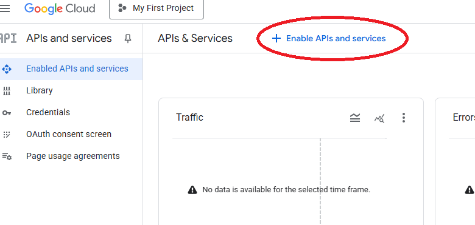
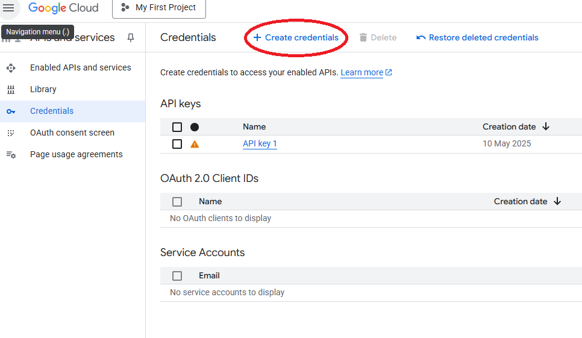

# Spelling Extractor & Emailer

A quick prototype created with LLM asistance, showing how to link a local LLM (Phi-3) with Google’s APIs, keeping all data local for privacy. It’s part of a wider “Local Business Assistant” system I’m building for automating small businesses.

Every week we get a PDF newsletter from our local school with next week’s spelling list. This tool:

1. **Fetches** the PDF  
2. **Extracts** the “next week’s spellings” block via Phi-3  
3. **Creates** a Google Doc (34 pt font, centered title & subtitle)  
4. **Exports** it to PDF and **emails** it for printing  

---

## 📁 Project Layout
```text
spelling-extractor/
├─ spelling_extractor/
│ ├── init.py
│ ├── pdf_parser.py # extract_text_from_pdf()
│ ├── llm_interface.py # run_phi_and_get_block()
│ ├── google_docs.py # create_spelling_doc(), get_credentials()
│ └── email_sender.py # send_doc_via_email()
│
├─ scripts/
│ └── extract_and_send.py # CLI orchestration
│
├─ requirements.txt
└─ README.md
```

## ⚙️ Prerequisites

- **Python 3.8+**  
- **Ollama** with the Phi-3 model installed  
- A Google Cloud project with the **Docs**, **Drive** and **Gmail** APIs **enabled**  
- **OAuth 2.0 Desktop-app** credentials → download JSON as `credentials.json`

---

## 🚀 Quick Start

### 1. Clone & install
```powershell
   git clone <repo-url>
   cd spelling-extractor
   python -m venv .venv
   .venv\Scripts\Activate.ps1    # (PowerShell on Windows)
   pip install -r requirements.txt
   pip install google-api-python-client google-auth-httplib2 google-auth-oauthlib
```

### 2. Enable & configure Google APIs

[In Cloud Console](console.cloud.google.com)→ APIs & Services → Library
enable Google Docs, Drive, and Gmail APIs.



Under Credentials, create a Desktop app OAuth client.



Download its JSON and save as credentials.json.

### 3. Run the script
```powershell
python -m scripts.extract_and_send <path to pdf> --to you@domain.com
```
On first run, grant:
- auth/documents
- auth/drive
- auth/gmail.send

### 4. **Check your inbox**
You’ll receive the PDF-formatted spelling list ready to print.

## Configuration
- OAuth redirect port: 12083
- Cached token: token.json
- Sender: the authenticated Google account

## How It Works
- PDF → text via PyMuPDF (pdf_parser.py).
- Text → spelling block via Phi-3 (llm_interface.py).
- Block → Google Doc with styling (google_docs.py).
- Doc → PDF & email via Gmail API (email_sender.py).

## Troubleshooting
- Redirect URI mismatch → use Desktop-app credentials.
- Insufficient scopes → delete token.json and re-run to re-consent.
- Drive API not enabled → enable in Cloud Console and wait a few minutes.

## License
MIT © Robin Plowman
